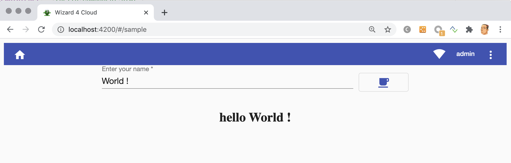
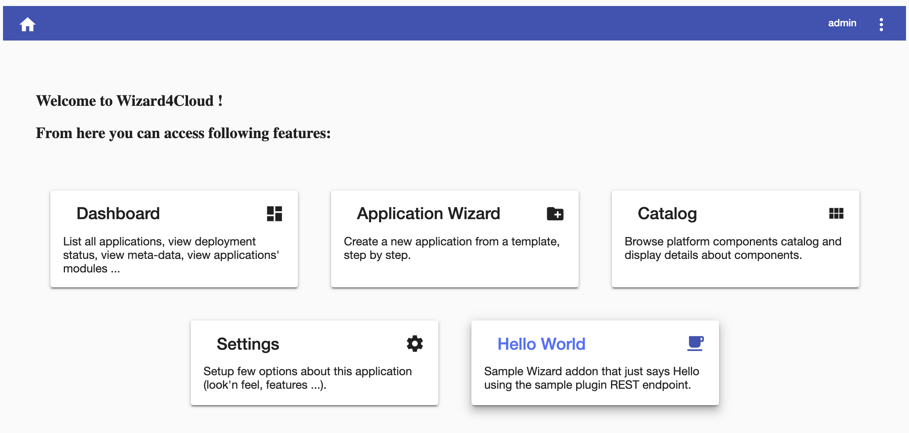

# alien4cloud-plugin-sample-addon

This is a sample wizard addon webapp that interacts with the REST
endpoint exposed by [alien4cloud-plugin-sample-plugin](../alien4cloud-plugin-sample-plugin) A4C plugin.

A wizard addon is a webapp that is completely independent from Wizard UI
but that can appear as a Wizard feature.
When properly embedded in an A4C distribution, it will be part of Wizard
webapp :
- it will appear as an option in wizard home page.
- it can have the same look and feel than the Wizard webapp.
- it can leverage on the benefits of wizard4cloud-commons library (generic services, i18n ...).

We have added this ability to embed addons in wizard because we had to add a very specific feature in a A4C distribution
but :
- we didn't want to write from scratch and deploy another webapp (with it's authentication ...).
- we didn't want to add this code to Wizard4Cloud since it's very specific to our project.

## Sample overview

Our sample webapp just display a text field where you can type your name, and a button to send the name to the REST endpoint exposed by backend part of [alien4cloud-plugin-sample-plugin](../alien4cloud-plugin-sample-plugin) A4C plugin. The result message is displayed below the text field.



The [hello.component](projects/alien4cloud-plugin-sample-addon/src/app/features/sample/hello/) uses the [sample.service](projects/alien4cloud-plugin-sample-addon/src/app/core/services/sample.service.ts) to request the REST endpoint exposed by the A4C plugin. Not that the service inherits from ``GenericService`` that comes from `@alien4cloud/wizard4cloud-commons` library.

## How-to run the sample

You need a working A4C instance including the [alien4cloud-plugin-sample-plugin](../alien4cloud-plugin-sample-plugin) A4C plugin.
Make sure the [proxy.conf.json](proxy.conf.json) target your running A4C instance.

```bash
node install
npm run start
```

Navigate to [http://localhost:4200](http://localhost:4200) using your favorite browser.

You'll need to use a valid A4C user to login (by default admin/admin).


## Anatomy of a Wizard Addon

A wizard addon is just an Angular webapp that:

- looks like the Wizard4Cloud.
- uses a common wizard library [@alien4cloud/wizard4cloud-commons](https://www.npmjs.com/package/@alien4cloud/wizard4cloud-commons).
- has a [wizard_addon.json](projects/alien4cloud-plugin-sample-addon/wizard_addon.json) description file.

### wizard_addon.json

This [wizard_addon.json](projects/alien4cloud-plugin-sample-addon/wizard_addon.json) file is scan by A4C to detect addons.
The wizard UI will get from A4C the list of found addons so that the home page can display a link to them.

Property | Description
-------- | -----------
id | A unique id for the addon. This id will be used to define the translation key for the feature link title and description.
iconName | The name of a [Angular material icon](https://www.angularjswiki.com/angular/angular-material-icons-list-mat-icon-list/) used in the Wizard home page link.
roles | An array of A4C roles names for which this feature will be activated.

### html files

The [index.html](projects/alien4cloud-plugin-sample-addon/index.html) is only used in development mode. The [wizard_addon.html](projects/alien4cloud-plugin-sample-addon/wizard_addon.html) will be targeted when embedded in Wizard webapp (don't rename it !).

### app module

The [app.module.ts](projects/alien4cloud-plugin-sample-addon/src/app/app.module.ts) looks like a regular Angular app module but has some particularities.

We import `W4cCommonsModule` and `W4cMaterialModule` that both come from [@alien4cloud/wizard4cloud-commons](https://www.npmjs.com/package/@alien4cloud/wizard4cloud-commons) library.

We provide a `AddonRedirectionProviderService` that also come from `@alien4cloud/wizard4cloud-commons`
This is used by the header component to handle correctly redirections to home and settings when we are in a addon webapp.

We provide a specific `TranslateLoader` to the `TranslateModule` via the `createTranslateLoader` factory function. This loader will used merged i18n files (merge of commons and addon i18n json files).

### app component

The [app.component.html](projects/alien4cloud-plugin-sample-addon/src/app/app.component.html) is the exact copy of the ``app.component.html`` found in the Wizard4cloud webapp.

### app routing

Our [app-routing.module.ts](projects/alien4cloud-plugin-sample-addon/src/app/app-routing.module.ts) :
- lazy loads our main module ([sample.module](projects/alien4cloud-plugin-sample-addon/src/app/features/sample/sample.module.ts)) for default path: as we do in Wizard we lazy load our features to have smaller bundles.
- lazy loads a wrapper module for login module coming from `@alien4cloud/wizard4cloud-commons` (at this time, we are not able to lazy load a module from a library, that's why we need [login-wrapper.module](projects/alien4cloud-plugin-sample-addon/src/app/login-wrapper.module.ts))

### i18n

The [projects/alien4cloud-plugin-sample-addon/assets](projects/alien4cloud-plugin-sample-addon/assets) folder is fed with asset folder of the `@alien4cloud/wizard4cloud-commons` library (see [package.json](package.json) `i18n-merge-*` scripts).
You should put your specific webapp i18n keys in [projects/alien4cloud-plugin-sample-addon/i18n](projects/alien4cloud-plugin-sample-addon/i18n) folder. They will be merged with the i18n file coming from the library.

To avoid key collisions (files will be merged with commons i18n files), you should always prefix your own keys using your addon id (here `sampleAddon`).

```json
  "sampleAddon": {
    "placeholder": "Enter your name",
    "tooltip": "Send request"
  }
```

In our [hello.component](projects/alien4cloud-plugin-sample-addon/src/app/features/sample/hello/hello.component.html) 
you can see that we have used key we have defined in [i18n/addon-*.json](projects/alien4cloud-plugin-sample-addon/i18n/addon-en.json) files. 
Header component use keys coming from commons i18n files.

Please note that we have added the ``Feature`` key in our i18n files : this is very important in order to make Wizard able to
translate the addons feature title and description in it's home page.

```json
  "Feature": {
    "sampleAddon": {
      "label": "Hello World",
      "description": "Sample Wizard addon that says Hello !"
    }
  }
```

Here ``sampleAddon`` must match the id we put in [wizard_addon.json](projects/alien4cloud-plugin-sample-addon/wizard_addon.json) file.
All addons i18n file will be merged to make the entries in key ``Feature`` available for wizard home page translation.

Please note that since the maven plugin we use to merge JSON in the overlay 
(wso2-maven-json-merge-plugin) doesn't well manage UTF-8 file (output are ascii files), 
you need to encode your "Feature" section using [HTML special chars](https://ascii.cl/htmlcodes.htm) 
for accentuated characters (é = ```&egrave```; è = ```&aacute;``` ...).

## Developing a new Wizard addon

If you want to develop your own addon webapp, you can :
- copy the content of this project.
- replace all occurence of `alien4cloud-plugin-sample-addon` by the name you want to give to your module (`my_addon` for example) is all files.
- rename the folder [projects/alien4cloud-plugin-sample-addon](projects/alien4cloud-plugin-sample-addon) to ``projects/my_addon``.
- adapt the [pom.xml](pom.xml).
- add your features in [projects/alien4cloud-plugin-sample-addon/src/app/features](projects/alien4cloud-plugin-sample-addon/src/app/features) folder and adapt routing in [projects/alien4cloud-plugin-sample-addon/src/app/features](projects/alien4cloud-plugin-sample-addon/src/app/features).

## Embedding an addon webapp in a4c war

If you want to embed your addon as a feature of Wizard4Cloud in a A4C distribution you'll need to overlay the default UI.
The project [alien4cloud-plugin-sample-overlay](../alien4cloud-plugin-sample-overlay) is a sample
of a war module that overlays the standard a4c war (that already contains the Wizard) and add our sample addon in order
to make it available as a wizard feature.  

To make an addon availaible in A4C webapp we need to :
- include the content of the addon webapp in the war.
- copy it's `wizard_addon.json` file into `wizard_addons` folder.
- merge it's ``addon-*.json`` files in commons ``addons-*.json`` to make addon title and description 
translations available for Wizard home page.



Please have a look to [alien4cloud-plugin-sample-overlay](../alien4cloud-plugin-sample-overlay/README.md) for more details about overlays.
