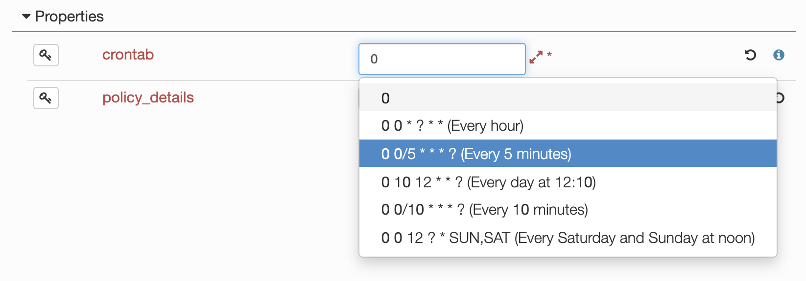

#alien4cloud-plugin-sample-suggestion

This plugin illustrates the way you can inject suggestions to help end-user when typing values in A4C.

## What's a suggestion ?

In A4C, all text inputs related to any TOSCA element can be suggested : 
when the user types a value, a list of proposed values appears, and the user can select his choice in this list.

Suggestions feature is not related to TOSCA, it's a UI feature for a better end-user experience.

Suggestions can be provided for a **property** of :
* A **node** type
* A **capability** type
* A **relationship** type
* A **data** type
* A **policy** type
* A topology **input**

This feature is only available for properties of **string** or TOSCA **version** type (or list/map of string or version).

Basically, a suggestion is a list of strings that can be proposed as input for a property. It can also have a description to help user decision.



A suggestion has a policy that define the UI behavior when a user types a value that is not in the suggested values :
* **Accept**: Don't ask for nothing, accept the value, but don't add it to registry (default mode).
* **Strict**: User only choose a value contained in the suggested values.
* **Ask**: Ask for the user what to do.
* **Add**: Add the new entry without asking the user.

You can provide suggestions configuration and propositions by plugin. This plugin illustrates this.

## Configure suggestions by plugin

To configure suggestions, a plugin must provide a collection of `SuggestionEntry`.
A `SuggestionEntry` defines :
* **es_type**: The kind of object concerned by the suggestion (nodetype, datatype ...). It's actually the ES index name that stores the type.
* **target_element_id**: ID of TOSCA element (for example: node type name).
* **target_property**: The property of the element that is concerned by the suggestions.
* **suggestion_policy**: The policy to apply when a new value is typed by the user.

The suggestions can be given by this configuration (static) or defines a plugin hook (a bean that will provide suggestions).

In the following example, this entry defines a suggestion for the property named _nested_ of _datatype_ `org.alien4cloud.sampleplugin.suggestions.datatypes.SampleComplexDataType` :
```
- es_index: toscaelement
  es_type: datatype
  target_element_id: org.alien4cloud.sampleplugin.suggestions.datatypes.SampleComplexDataType
  target_property: nested
  suggestion_policy: Strict
  suggestions:
    - One
    - Two
    - Tree
```

The policy is **Strict**, so the end-user MUST one of the provided values : _One_, _Two_ or _Tree_.

Our plugin provides a component (a Spring bean) that acts has a [suggestion configurator](src/main/java/alien4cloud/sampleplugin/suggestions/SuggestionConfigurator.java).

It parses the content of the [a4c-sampleplugin-suggestions-configuration.yml](src/main/resources/suggestions/a4c-sampleplugin-suggestions-configuration.yml) file.
Some of them are static (values are provided directly in the config), and some others are configured to let a hook bean provide suggestion values (read comments in the yaml file).

>  Please use a distinguished name for this file, for example by prefixing it's name by the pluginId (risks of collisions in classpath).

## Provide suggestions by plugin

The [TestSuggestionProvider](src/main/java/alien4cloud/sampleplugin/suggestions/providers/TestSuggestionProvider.java) is a very simple implementation of a `ISimpleSuggestionPluginProvider`

Suggestions providers are bean that must inherit one of the following interface :
* `ISimpleSuggestionPluginProvider`: they must provide a list of strings.
* or `IComplexSuggestionPluginProvider`: they must provide a list of `Suggestion` (a value/description tuple).

Note that the methode `alien4cloud.sampleplugin.suggestions.providers.TestSuggestionProvider.getSuggestions` receive the context as argument.

This context represents what the end user is doing when the suggestions are requested. It contains :
* `user`: the user object that is editing the property.
* `type`: the kind of action the user is doing. Editing a suggestable property can be done in many contexts in the a4c UI :
    * `TopologyEdit`: The user is editing a topology.
    * `DeploymentInput`: The user is setting deployment inputs.
    * `OrchestratorResourceConfiguration`: The user is setting an orchestrator resource.
    * `OrchestratorPolicyConfiguration`: The user is setting an orchestrator policy.
    * `DeploymentNodeMatching`: The user is setting a node matching during a deployment flow.
    * `DeploymentPolicyMatching`: The user is setting a policy matching during a deployment flow.
    * `ServiceConfiguration`: The user is setting a service (admin).
* `data`: an object that can have contextual values:
    * `applicationId`: Set when the user is editing an application topology, setting a deployment input, setting matching resources.
    * `topologyId`: Set when the user is editing a topology.
    * `environmentId`: Set when the user is working on an environment (deployment matching, editing environment topology, setting inputs).
    * `nodeId`: Set when a property being edited is related to a given node in a topology.
    * `policyId`: Set when a property being edited is related to a policy.
    * `resourceId`: Set when a property being edited is related to a resource (service configuration, resource configuration, matching).
    * `capabilityId`: Set when a property being edited is related to a capability of a node.
    * `relationshipId`: Set when a property being edited is related to a relationship of a node.
    * `propertyName`: The property name or the full property path of the property that is being edited (in case of nested).

All these contextual data can help you to define what you should return if you have to embed logic in your suggestion provider.

The [VersionSuggestionProvider](src/main/java/alien4cloud/sampleplugin/suggestions/providers/VersionSuggestionProvider.java) illustrates how you can use such contextual data.

It is in charge of providing a list of versions for the property `vaccin_version` of the embedded TOSCA node type `org.alien4cloud.sampleplugin.suggestions.nodes.SuggestionSampleComponent`.
When the context edition is related to a topology edition, the result will depend on the value of another property of the node.

> Please note that the topology is not retrieved the same way regarding the fact we are in an edition context or not. 
> Using the `EditorService` when the user is editing a topology make us able to access property values even if the topology is not saved.

The provider will also provide different values if the current environment is a production environment or not (`-SNAPSHOT` is added to every version number when the environment is not a production environment).

Finally, the [CountrySuggestionProvider](src/main/java/alien4cloud/sampleplugin/suggestions/providers/CountrySuggestionProvider.java) is an example of a provider that requests an external source of data to provide suggestions. 
It uses the REST service available at [restcountries.eu](https://restcountries.eu/rest/v2/).

> Please be aware that the method `getSuggestions` of your provider will be called each time the end-user will type something in a suggestable property UI field.
> If your provider need to acces remote resource, ensure performances will be OK, or cache what you can cache if possible !

